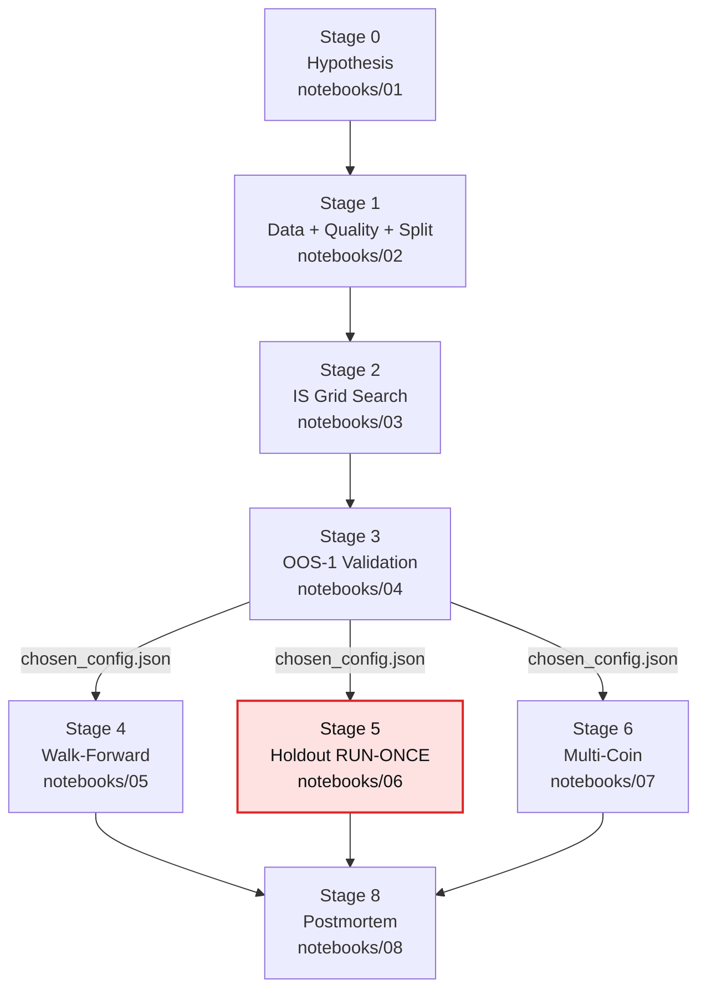

# Architecture

This document describes the runtime architecture of the research framework and the data-flow contracts between stages.

## Stage pipeline



## Data flow

| Producer | Consumer | Artifact |
|----------|----------|----------|
| `loader.download_to_parquet` | Stage 1 | `data/raw/{SYMBOL}_{INTERVAL}.parquet` |
| `splitter.split_time_series` | Stages 3, 5 | `data/processed/split_{SYMBOL}_{INTERVAL}.pkl` |
| `optimization.grid_search` | Stage 3 | `results/tables/is_search_log.csv` |
| Notebook 03 | Stage 3 | `data/processed/top10_is_candidates.json` |
| Notebook 04 | Stages 4, 5, 6 | `data/processed/chosen_config.json` |
| Notebook 06 | Stage 8 | `results/tables/holdout_result.json` |
| Notebook 07 | Stage 8 | `results/tables/multi_coin_results.csv` |

## Source layout

```
src/quant/
├── data/
│   ├── loader.py        Binance USDT-futures klines fetcher
│   ├── quality.py       Missing bars / outliers / OHLC validity
│   └── splitter.py      IS / OOS-1 / Holdout (time-ordered, immutable)
├── strategies/
│   ├── base.py          Abstract Strategy + Signal enum
│   └── mean_reversion.py  Asian Session Extreme Fade
├── backtest/
│   ├── costs.py         HORROR (default) + BASE cost models
│   ├── metrics.py       PF / Sharpe / MaxDD / CAGR / win-rate
│   └── engine.py        Generic engine (stubbed; MR has its own simulator)
├── validation/
│   ├── deflated_sharpe.py  Bailey & López de Prado (2014)
│   ├── walk_forward.py     6-month rolling validation
│   └── bootstrap.py        Block bootstrap (Politis & Romano 1994)
├── risk/
│   ├── sizing.py        Fixed-fractional, volatility-targeted
│   └── drawdown.py      Max drawdown, underwater duration
├── reporting/
│   ├── plots.py         (stubbed)
│   └── tables.py        (stubbed)
└── optimization/
    └── grid_search.py   IS optimization runner
```

## Invariants enforced by tests

| Test file | Invariant |
|-----------|-----------|
| `test_no_lookahead.py` | Signal at time t depends only on data up to t. Includes meta-test that a deliberately-broken cheat strategy fails. |
| `test_data_split_integrity.py` | Splits are time-ordered, immutable, non-overlapping. |
| `test_costs.py` | Default cost mode is HORROR. Round-trip math correct. |
| `test_deflated_sharpe.py` | PSR at benchmark = 0.5. DSR deflates with N. |
| `test_drawdown.py` | Monotonic = 0 DD. 100→50 = 50% DD. |
| `test_bootstrap.py` | CI brackets point estimate. 99% wider than 90%. |
| `test_walk_forward.py` | Window generation time-ordered + correct count. |
| `test_mean_reversion.py` | Entry conditions + HORROR cost + time stop. |

## Cost-mode policy

| Mode | Slippage | Use |
|------|----------|-----|
| HORROR (default) | 0.20% | All reported numbers, all stages |
| BASE | 0.05% | Internal debugging only; **never** in any output |

`get_cost_model()` returns HORROR. Callers must explicitly opt into BASE.

## Reproducibility contract

`make all` from a fresh clone:

1. `uv sync --frozen` installs the exact dependency versions from `uv.lock`
2. `pre-commit install` registers the hooks
3. `make check` runs ruff + mypy + pytest

`bash scripts/run_pipeline.sh` then re-executes notebooks 02-08 in order, regenerating all figures and tables. Stage 5 (`06_holdout.ipynb`) re-execution technically violates the SOP unless the user is intentionally invalidating prior holdout claims.
